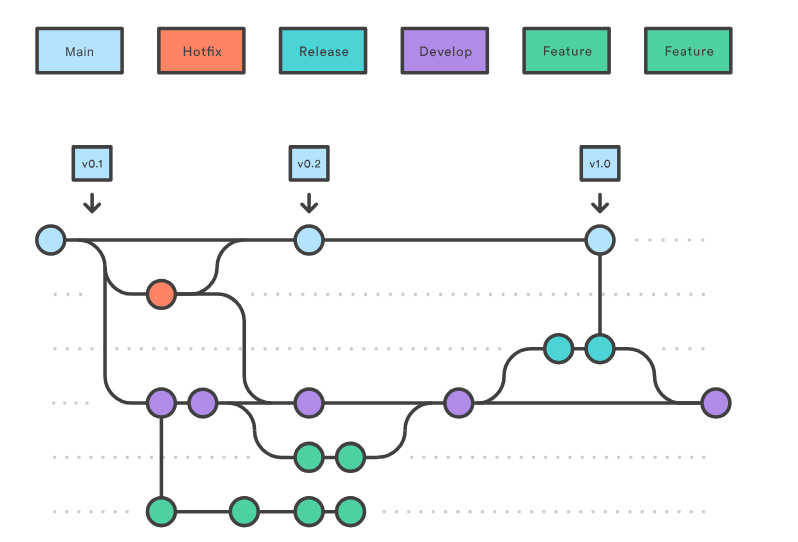
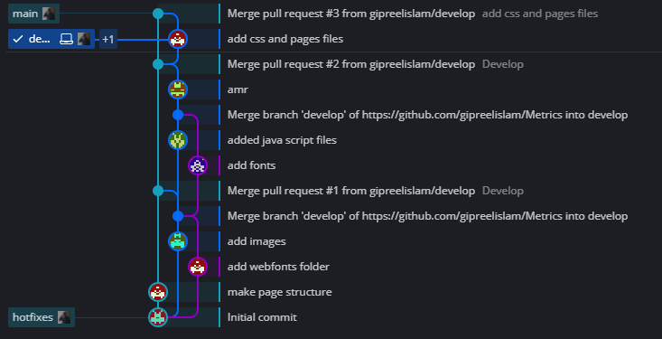

# Metrics
You can visit our site from the link below  
[Link](https://gipreelislam.github.io/Metrics/) 
we published our site using github host

## Metrics Description
our project is a front-end web page build by 6 students  
[Repo Link](https://github.com/gipreelislam/Metrics.git)
____
## Project Workflow on Github
we use gitflow workflow but we just make 3 branches
- main branch
- develop branch
- hotfix branch
  
We use gitkraken to visualize the workflow on the branches 

